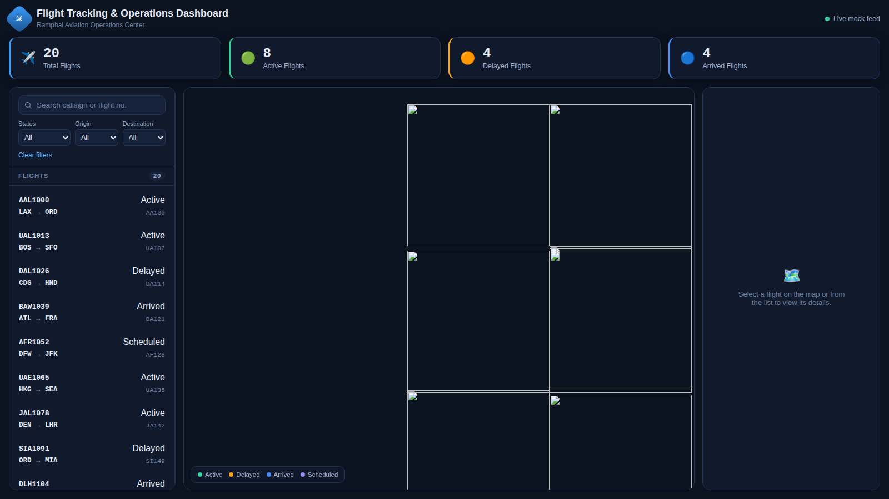

# Flight Tracking & Operations Dashboard

An Angular 16 + Leaflet dashboard for aviation operations personnel to monitor flights in real time, built for the Ramphal Technologies Frontend Developer (Angular & UI/UX) assessment.



## Features

- **Interactive flight map (Leaflet)** — 20 mock flights plotted as rotated plane markers, colour-coded by status, with a popup summary on click.
- **Flight route visualization** — selecting a flight highlights its marker, draws a dashed polyline between origin and destination, and flies the map to fit the route.
- **Flight details panel** — flight number, callsign, aircraft type, origin/destination, status, estimated departure/arrival, altitude and speed.
- **Operations KPI cards** — total, active, delayed and arrived flight counts, computed live from the flight list.
- **Search & filters** — search by callsign/flight number, filter by status, origin airport, destination airport (Reactive Forms + RxJS).
- **Responsive layout** — three-pane layout on desktop, sidebar/map + details drawer on tablet, single-column stack on narrow screens.
- **Shareable routes** — selecting a flight updates the URL to `/flight/:id` so a specific flight can be deep-linked or bookmarked.

## Tech stack

| Requirement          | Implementation                                   |
|-----------------------|---------------------------------------------------|
| Angular 16+            | Angular 16.2 (NgModule-based)                    |
| TypeScript             | Strict mode, typed models in `core/models`       |
| Reactive Forms          | `FlightSidebarComponent` search/filter form      |
| Routing                 | `AppRoutingModule` (`/`, `/flight/:id`)          |
| Services                | `FlightService` (single source of truth)         |
| RxJS                    | `BehaviorSubject`/`combineLatest`/`shareReplay` pipelines for filtering, KPIs, selection |
| Leaflet Maps             | `flight-map` feature component                   |
| Mock data                | `src/assets/data/mock-flights.json` (no backend) |

## Project structure

```
src/app/
  core/
    models/flight.model.ts        # Flight, Airport, Filters, KPI types
    services/flight.service.ts    # Loads mock data, exposes filtered/selected streams
  features/
    dashboard/                    # Page shell: header + KPI row + 3-pane layout
    kpi-cards/                    # Total / Active / Delayed / Arrived cards
    flight-sidebar/               # Search, filters (Reactive Forms), flight list
    flight-map/                   # Leaflet map, markers, route polyline
    flight-details/               # Selected flight detail panel
  app.module.ts
  app-routing.module.ts
src/assets/data/mock-flights.json # 20 mock flights with realistic routes/coordinates
```

## Getting started

### Prerequisites
- Node.js 18+ (Node 20 LTS recommended)
- npm 9+

### Install & run

```bash
npm install
npm start          # ng serve — http://localhost:4200
```

### Production build

```bash
npm run build       # outputs to dist/flight-tracking-dashboard
```

### Run unit tests

```bash
npm test
```

## Notes on the mock data

`src/assets/data/mock-flights.json` contains 20 flights across major global airports (JFK, LAX, ORD, LHR, DXB, HND, SIN, SYD, etc.) with real coordinates. Each flight has a status (`Active`, `Delayed`, `Arrived`, `Scheduled`); the `currentPosition` for active/delayed flights is interpolated along the straight line between origin and destination so markers appear mid-route on the map, with a `heading` used to rotate the plane icon.

## Known limitations / next steps

- Positions are static (no live animation loop) — flagged as an optional bonus feature in the brief; the data model already carries `heading`, so a `setInterval`/`requestAnimationFrame` playback could be added on top of the existing `FlightService` state.
- No backend — all data is local JSON, per the assignment's "mock data, no backend implementation required" requirement.
- Map tiles are loaded from CartoDB's public dark basemap (`basemaps.cartocdn.com`), so an internet connection is required to see the base map; markers, routes and all other UI work fully offline against local data.
